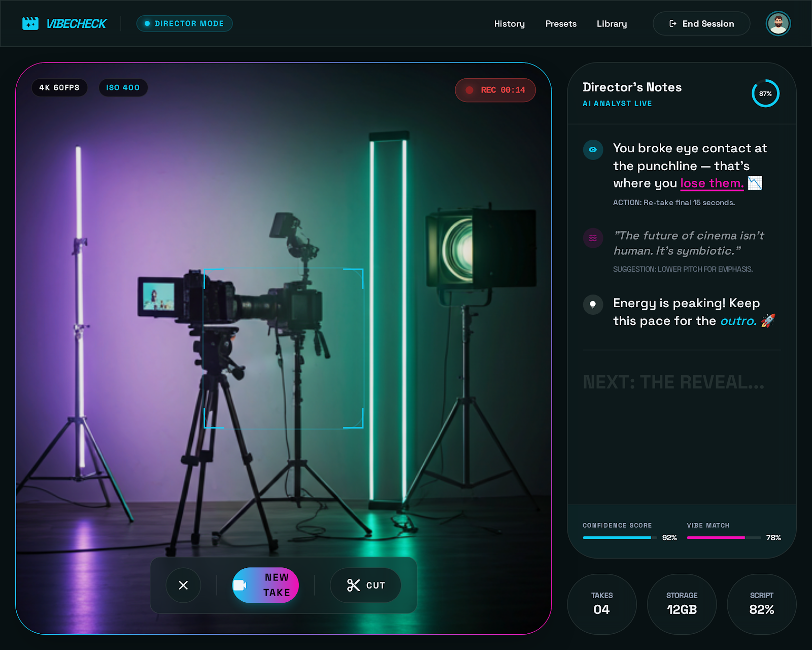

# 🎬 VibeCheck

**Your real-time AI director. No bad takes.**



📖 **Read the full story:** [I Built an AI That Watches You Film TikToks and Coaches You in Real-Time](https://hashnode.com/edit/cmm6mqbzj001b2eoi68qlabau)

VibeCheck watches you film through your webcam, coaches you live through your earbuds, scores every take, and generates your TikTok caption — so you never post a bad take again.

Built for the **Vision Possible: Agent Protocol** hackathon by WeMakeDevs × VisionAgents (Feb 23 – Mar 1, 2026).

---

## 💡 Why VibeCheck?

**Content creators waste hours doing 50+ takes of the same video.** There's no real-time feedback loop — they film alone, review alone, and guess what went wrong.

VibeCheck solves this with a live AI director that watches you film and coaches you through your earbuds, cutting production time in half.

- 🎯 **Saves creator time** — Real-time feedback eliminates wasted takes
- 📈 **Improves content quality** — AI catches what humans miss (eye contact, energy dips, posture)
- 🌍 **Democratises professional coaching** — Every creator gets a personal director, free

---

## 🎥 How It Works

```
Pick a Mode → Describe Your Video → Film with Live AI Coaching → Get Your Results
```

1. **Choose your vibe** — Director (precise), Bestie (hype), or Roast (chaos)
2. **Describe your video** — "30-second storytime about missing my flight"
3. **Film live** — AI watches via YOLO pose detection + Moondream face analysis and coaches you in real-time through Gemini
4. **Get results** — Eye contact %, energy score, aesthetic profile, and a generated TikTok caption with hashtags

---

## 🏗️ Architecture

```
┌─────────────────────────────────────────────────┐
│  Frontend (React + Vite + Framer Motion)        │
│  ┌──────────┐  ┌──────────┐  ┌──────────────┐  │
│  │ModeSelect│→ │TopicInput│→ │VibeSession   │  │
│  └──────────┘  └──────────┘  └──────┬───────┘  │
│                                      │          │
│                               ┌──────┴───────┐  │
│                               │ResultsScreen │  │
│                               └──────────────┘  │
└──────────────────┬──────────────────────────────┘
                   │  HTTP + Stream WebRTC
┌──────────────────┴──────────────────────────────┐
│  Backend (FastAPI + Vision Agents SDK)           │
│  ┌────────────────────────────────────────────┐  │
│  │ Agent                                      │  │
│  │  ├─ YOLO Pose Processor (5 FPS)           │  │
│  │  ├─ Moondream CloudDetectionProcessor     │  │
│  │  ├─ Deepgram STT (real-time audio)        │  │
│  │  ├─ TakeTracker Processor (5 FPS)         │  │
│  │  ├─ FaceProcessor (5 FPS)                 │  │
│  │  ├─ VibeProcessor (2 FPS)                 │  │
│  │  └─ Gemini Realtime LLM (3 FPS)          │  │
│  │     ├─ score_take_tool()                  │  │
│  │     ├─ session_summary_tool()             │  │
│  │     └─ generate_caption_tool()            │  │
│  └────────────────────────────────────────────┘  │
└──────────────────────────────────────────────────┘
```

---

## 🤖 AI Models Used

| Model               | Role                             | SDK                                                   |
| ------------------- | -------------------------------- | ----------------------------------------------------- |
| **YOLO v11**        | Real-time pose tracking (5 FPS)  | `ultralytics.YOLOPoseProcessor` via Vision Agents     |
| **Gemini Realtime** | Live coaching LLM + tool calling | `gemini.Realtime` via Vision Agents                   |
| **Moondream**       | Face & person detection          | `moondream.CloudDetectionProcessor` via Vision Agents |
| **Deepgram Nova-2** | Real-time speech-to-text         | `deepgram.STT` via Vision Agents                      |

All models are integrated through the **Vision Agents SDK** running on the **Stream Edge** network.

---

## 🛠️ Tech Stack

| Layer            | Technology                                                   |
| ---------------- | ------------------------------------------------------------ |
| **Frontend**     | React 19, TypeScript, Vite, Tailwind CSS, Framer Motion      |
| **Video/WebRTC** | Stream Video React SDK (`@stream-io/video-react-sdk`)        |
| **Backend**      | Python, FastAPI, Vision Agents SDK                           |
| **AI Framework** | Vision Agents (YOLO + Gemini + Moondream + Deepgram plugins) |
| **Real-time**    | Stream Edge network, WebRTC                                  |
| **Recording**    | Browser MediaRecorder API (WebM/VP9)                         |

---

## 🚀 Quick Start

### Prerequisites

- Node.js 18+
- Python 3.10+
- API keys: Stream, Moondream, Deepgram

### 1. Backend

```bash
cd agent
python -m venv .venv
source .venv/bin/activate   # Windows: .venv\Scripts\activate
pip install -r requirements.txt

# Create .env
cat > .env << EOF
STREAM_API_KEY=your_stream_api_key
STREAM_API_SECRET=your_stream_api_secret
GEMINI_API_KEY=your_gemini_key
ELEVENLABS_API_KEY=your_elevenlabs_key
MOONDREAM_API_KEY=your_moondream_key
DEEPGRAM_API_KEY=your_deepgram_key
EOF

python server.py
```

Backend runs at `http://localhost:8000`.

### 2. Frontend

```bash
cd frontend
npm install

# Create .env
echo "VITE_API_URL=http://localhost:8000" > .env

npm run dev
```

Frontend runs at `http://localhost:5173`.

### 3. Use It

1. Open `http://localhost:5173` in Chrome
2. Pick a mode (Director / Bestie / Roast)
3. Describe your video topic
4. Allow camera + mic access
5. Hit **New Take** to start recording
6. AI coaches you live through your speakers/earbuds
7. Hit **Cut** to end a take, **End Session** to see results

---

## 📱 PWA Support

VibeCheck is a Progressive Web App. On mobile:

1. Open the URL in Safari (iOS) or Chrome (Android)
2. Tap **"Add to Home Screen"**
3. Opens fullscreen — no browser chrome, native app feel

---

## 📂 Project Structure

```
vibecheck/
├── agent/                    # Python backend
│   ├── server.py             # FastAPI server
│   ├── agent.py              # Vision Agents setup
│   └── processors/           # Custom AI processors
│       ├── take_tracker.py
│       ├── face_processor.py
│       └── vibe_processor.py
│
├── frontend/                 # React web app
│   ├── src/
│   │   ├── App.tsx           # Screen router + AnimatePresence
│   │   ├── index.css         # Tailwind + design tokens
│   │   └── components/
│   │       ├── ModeSelector.tsx
│   │       ├── TopicInput.tsx
│   │       ├── VibeSession.tsx
│   │       └── ResultsScreen.tsx
│   └── public/
│       └── manifest.json     # PWA manifest
│
└── README.md                 # ← You are here
```

---

## 🏆 Judging Criteria Alignment

| Criterion                     | Score  | Evidence in VibeCheck                                                                                                                                                                   |
| ----------------------------- | ------ | --------------------------------------------------------------------------------------------------------------------------------------------------------------------------------------- |
| **Potential Impact**          | ⭐⭐⭐ | Targets 200M+ content creators. Eliminates wasted takes, cuts production time in half, democratises professional coaching.                                                              |
| **Creativity & Innovation**   | ⭐⭐⭐ | First real-time AI video director. 3 personality modes (Director/Bestie/Roast). Live voice coaching, not post-production.                                                               |
| **Technical Excellence**      | ⭐⭐⭐ | 5 custom processors, 3 LLM tool calls, multi-model pipeline (YOLO + Moondream + Gemini + Deepgram), clean API-first backend.                                                            |
| **Real-Time Performance**     | ⭐⭐⭐ | YOLO pose at 5 FPS, Moondream aesthetic at 2 FPS, Gemini coaching at 3 FPS, Deepgram STT in real-time. Sub-second latency via Stream Edge.                                              |
| **User Experience**           | ⭐⭐⭐ | Cinematic UI with Framer Motion, glassmorphism design system, live HUD overlay, animated results with SVG donuts and counters.                                                          |
| **Best Use of Vision Agents** | ⭐⭐⭐ | Uses `Agent`, `Edge`, `Runner`, `gemini.Realtime`, `ultralytics.YOLOPoseProcessor`, `moondream.CloudDetectionProcessor`, `deepgram.STT`, 3 custom `VideoProcessorPublisher` subclasses. |

---

## 👤 Notes for Judges

- **Single device setup**: Laptop runs VibeCheck (camera + coaching output)
- **Dual device setup**: Laptop runs VibeCheck, phone records the actual TikTok
- **Best in Chrome** for MediaRecorder VP9 support
- **First load takes ~10s** — YOLO model cold-loads on first session start
- **PWA installable** on mobile for native app feel

---

## 📄 License

Built for the Vision Possible hackathon. MIT License.
